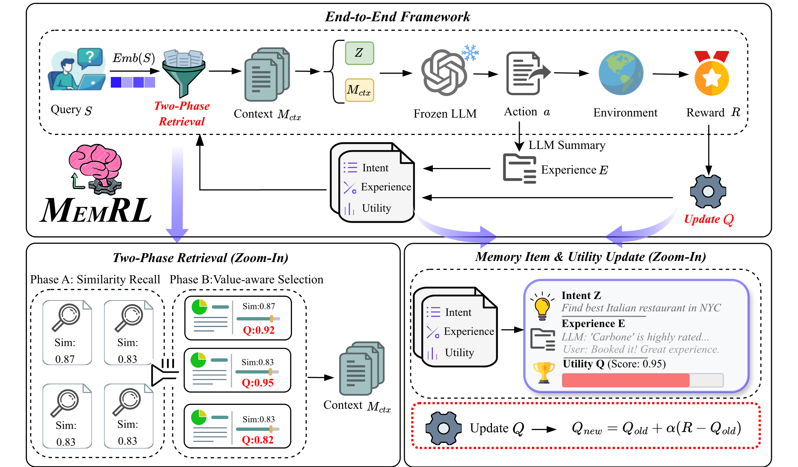

# MemRL: Self-Evolving Agents via Runtime Reinforcement Learning on Episodic Memory

Official code release for the paper:

[**MemRL: Self-Evolving Agents via Runtime Reinforcement Learning on Episodic Memory**](https://arxiv.org/abs/2601.03192)

## Abstract

The hallmark of human intelligence is the self-evolving ability to master new skills by learning from past experiences. However, current AI agents struggle to emulate this self-evolution: fine-tuning is computationally expensive and prone to catastrophic forgetting, while existing memory-based methods rely on passive semantic matching that often retrieves noise. To address these challenges, we propose **MemRL**, a non-parametric approach that evolves via reinforcement learning on episodic memory. By decoupling stable reasoning from plastic memory, **MemRL** employs a Two-Phase Retrieval mechanism to filter noise and identify high-utility strategies through environmental feedback. Extensive experiments on **HLE**, **BigCodeBench**, **ALFWorld**, and **Lifelong Agent Bench** demonstrate that **MemRL** significantly outperforms state-of-the-art baselines, confirming that **MemRL** effectively reconciles the stability-plasticity dilemma, enabling continuous runtime improvement without weight updates.

## Framework Overview

Click to open the PDF:

[](framework_overview.pdf)

Files:
- `framework_overview.png` (preview)
- `framework_overview.pdf` (vector)

## Installation

This repo is a Python package under the **`memrl`** namespace.

### Option A: pip (recommended)

```bash
python -m venv .venv
source .venv/bin/activate

pip install -U pip
pip install -e ".[dev]"
```

### API keys / endpoints

All benchmarks read LLM + embedding settings from YAML configs under `configs/`.
Before running, set at least:

- `llm.api_key`
- `embedding.api_key`
- (optional) `llm.base_url` / `embedding.base_url` for OpenAI-compatible endpoints (vLLM, etc.)

Example configs:

- `configs/rl_bcb_config.yaml` (BigCodeBench)
- `configs/rl_llb_config.yaml` (Lifelong Agent Bench)
- `configs/rl_alf_config.yaml` (ALFWorld)
- `configs/rl_hle_config.yaml` (HLE)

## Running the 4 Benchmarks

All runners write logs under `logs/` and results under `results/` (configurable via `experiment.output_dir`).

### 1) BigCodeBench (BCB)

Run multi-epoch BCB memory benchmark:

```bash
python run/run_bcb.py \
  --config configs/rl_bcb_config.yaml \
  --subset hard \
  --split instruct \
  --epochs 3
```

Dataset:

- Default path: `data/bigcodebench/bigcodebench_{hard|full}.jsonl`
- Override with: `--data_path /path/to/bigcodebench_hard.jsonl`

If the JSONL is missing, the runner prints an actionable download command (via `datasets`).

Splits:

- Default: `configs/bigcodebench/splits/{hard_seed42|full_seed123}.json`
- Override with: `--split_file /path/to/split.json`

Notes:

- BigCodeBench evaluation uses the vendored repo under `3rdparty/bigcodebench-main`.
- Retrieval threshold: use `--retrieve_threshold` to override; otherwise it falls back to `rl_config.sim_threshold` (then `rl_config.tau`).

### 2) Lifelong Agent Bench (LLB / LifelongAgentBench)

This repo vendors LifelongAgentBench under `3rdparty/LifelongAgentBench` and runs it through `memrl/run/llb_rl_runner.py`.

Quick start:

1. Edit `configs/rl_llb_config.yaml`:
   - set `llm.api_key` / `embedding.api_key`
   - set `experiment.task` (`db` | `os` | `kg`)
   - set `experiment.split_file` (and optional `experiment.valid_file`)
2. Run:

```bash
python run/run_llb.py
```

Dataset:

- This repo’s runner expects a JSON dictionary keyed by `sample_index`, e.g.:
  `data/llb/os_interaction_train500.json`

Optional tracing (LLB):

- `configs/rl_llb_config.yaml` includes `experiment.trace_jsonl_path`.
- You can also control tracing with environment variables (see `memrl/trace/llb_jsonl.py`).

### 3) ALFWorld

Run:

```bash
python run/run_alfworld.py --config configs/rl_alf_config.yaml
```

Important notes:

- You must install ALFWorld and prepare its data according to the ALFWorld/TextWorld setup.
- This repo expects an ALFWorld environment config at:
  `configs/envs/alfworld.yaml`
  (create this file during ALFWorld setup).
- Few-shot examples are expected at `data/alfworld/alfworld_examples.json` (provided in configs, Same as [ReAct](https://github.com/ysymyth/ReAct)) (configurable via `experiment.few_shot_path`).

### 4) HLE

Run:

```bash
python run/run_hle.py \
  --config configs/rl_hle_config.yaml \
  --train /path/to/hle_train.parquet \
```

Notes:

- The runner accepts `--categories` and `--category_ratio` for category filtering/sampling.
- By default, it looks for a parquet next to the repo (e.g., `../hle/test-00000-of-00001-filtered.parquet`) Notice: We processed some questions' pictures from 'gif' to 'png', because its pic is actually a static pic.
- `--judge_model` controls an optional separate judge LLM. We choose GPT-4o to align with [artificialanalysis](https://artificialanalysis.ai/evaluations/humanitys-last-exam).

## Project Layout

- `memrl/`: main library code (MemoryService, runners, providers, tracing)
- `run/`: benchmark entrypoints (`run_bcb.py`, `run_llb.py`, `run_alfworld.py`, `run_hle.py`)
- `configs/`: benchmark configs
- `3rdparty/`: vendored benchmark repos (BigCodeBench, LifelongAgentBench)

## Citation

If you use MemRL in your research, please cite our paper:

```bibtex
@misc{zhang2026memrlselfevolvingagentsruntime,
  title         = {MemRL: Self-Evolving Agents via Runtime Reinforcement Learning on Episodic Memory},
  author        = {Shengtao Zhang and Jiaqian Wang and Ruiwen Zhou and Junwei Liao and Yuchen Feng and Weinan Zhang and Ying Wen and Zhiyu Li and Feiyu Xiong and Yutao Qi and Bo Tang and Muning Wen},
  year          = {2026},
  eprint        = {2601.03192},
  archivePrefix = {arXiv},
  primaryClass  = {cs.CL},
  url           = {https://arxiv.org/abs/2601.03192},
}
```
